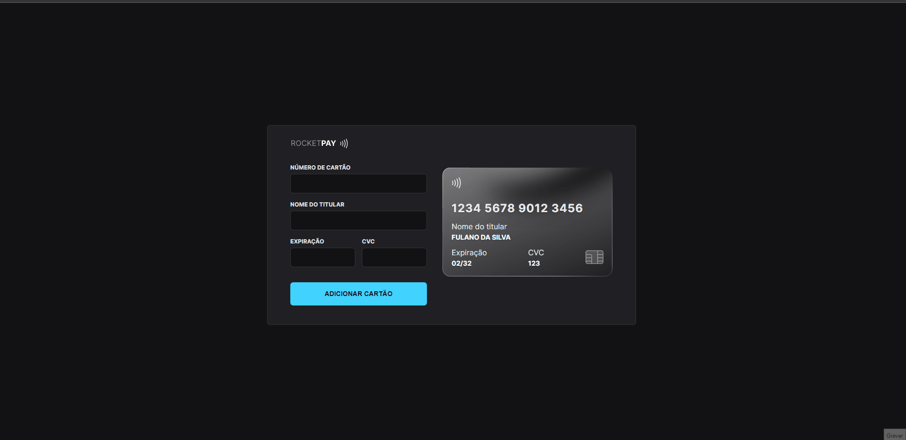

<h1 align="center">Explorer Lab #01 🚀</h1>

  

  <a href="https://explorer-lab-teal.vercel.app/">Veja o Site</a>

 

## 🚀 Tecnologias

Esse projeto foi desenvolvido com as seguintes tecnologias:

- HTML e CSS
- JavaScript e JSON
- [Node e NPM](https://nodejs.org/)
- [Vite](https://vitejs.dev/)
- [iMask](https://imask.js.org)

 

## 💻 Projeto

O Rocketpay é um componente que simula o formulário de preenchimento de cartão de crédito, onde é possível adicionar máscara aos inputs e atualizar elementos HTML via DOM.

 

 Desenvolvido com 💙 por Elias de Araújo Ferreira Neto 👋 

